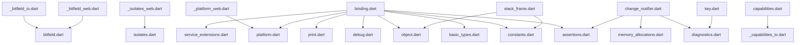

<!---
Generated by https://github.com/polina-c/layerlens
-->

```mermaid
flowchart TD;
_bitfield_io.dart-->bitfield.dart;
_bitfield_web.dart-->bitfield.dart;
_isolates_web.dart-->isolates.dart;
_platform_web.dart-->platform.dart;
binding.dart-->assertions.dart;
binding.dart-->basic_types.dart;
binding.dart-->constants.dart;
binding.dart-->debug.dart;
binding.dart-->object.dart;
binding.dart-->platform.dart;
binding.dart-->print.dart;
binding.dart-->service_extensions.dart;
capabilities.dart-->_capabilities_io.dart;
change_notifier.dart-->assertions.dart;
change_notifier.dart-->diagnostics.dart;
change_notifier.dart-->memory_allocations.dart;
key.dart-->diagnostics.dart;
stack_frame.dart-->constants.dart;
stack_frame.dart-->object.dart;
```

